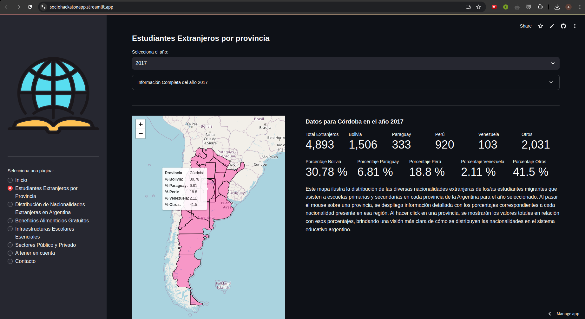

# Migrantes en la Escuela Argentina. Del Derecho al Hecho.
**Análisis de la distribución de niños/as y adolescentes migrantes en las escuelas argentinas y las condiciones estructurales de los establecimientos educativos, entre 2011 y 2023.**

**Integrantes**

- Benitez Siciliano Paola. Estudiante de la Licenciatura en Sociología, Facultad de Ciencias Sociales.
- Castillo Paulina, Estudiante de la Licenciatura en Ciencia Política, Facultad de Ciencias Sociales.
- Carrara María Ángeles. Estudiante de la Licenciatura en Ciencias de la Computación, Facultad de Matemática, Astronomía, Física y Computación.
- Giletta Antonella Giuliana. Estudiante de la Licenciatura en Sociología, Facultad de Ciencias Sociales.
- Perez Sbarato Rocío. Estudiante de la Licenciatura en Ciencias de la Computación, Facultad de Matemática, Astronomía, Física y Computación.

# Tablero interactivo hecho con Python y Streamlit

Este repositorio consiste en el anexo de código del tablero para la visualización de los datos analizados en el trabajo "La permanencia de la desigualdad. Del derecho al hecho: Análisis de la distribución de niños/as y adolescentes migrantes en las escuelas argentinas y las condiciones estructurales de los establecimientos educativos, entre 2011 y 2023" presentado en el Socio-Hackaton "Investigar en Sociales". Aquí encontrarás el código que usamos para crear esta presentación amigable e interactiva del análisis de datos realizado. 

Más detalle sobre el proyecto y procesamiento de los datos [aquí](https://github.com/rocio-perez-sbarato/SocioHackaton). 

## Screenshot


## Demo 

- Para acceder al tablero desde el navegador (sin necesidad de instalar Python ni `streamlit`), haga click en el botón de abajo: 
  
  [](https://sociohackatonapp.streamlit.app/)

## Instrucciones de uso

```
pip install -r requirements.txt
streamlit run app.py
```

## Trabajo a Futuro

En futuras actualizaciones de la aplicación, se contemplan las siguientes mejoras:

- **Factorizar el código**: Revisar y simplificar el código para mejorar la legibilidad y la mantenibilidad, reduciendo la duplicación de código y mejorando la modularidad.
- **Unificar estilo**: Establecer y aplicar un estilo de codificación consistente a lo largo del proyecto para facilitar la colaboración y la comprensión del código por parte de otros desarrolladores.
- **Mejorar la compatibilidad móvil**: Hacer que la aplicación sea más responsive y amigable para dispositivos móviles, asegurando que todos los elementos de la interfaz de usuario se adapten adecuadamente a diferentes tamaños de pantalla.

Estas mejoras no solo aumentarán la calidad del código, sino que también proporcionarán una mejor experiencia de usuario.
